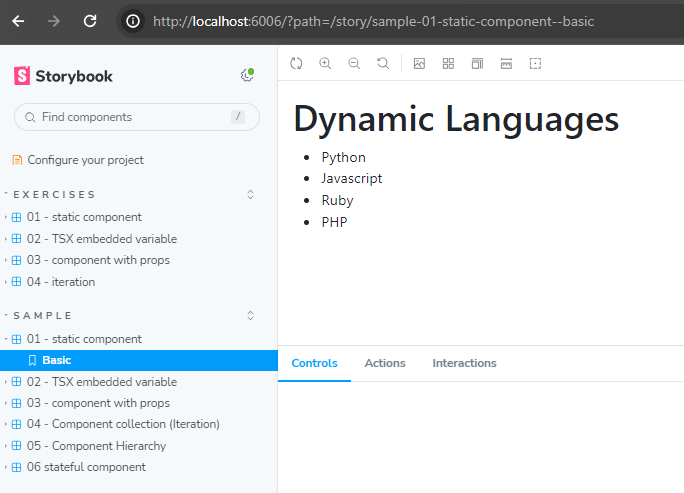
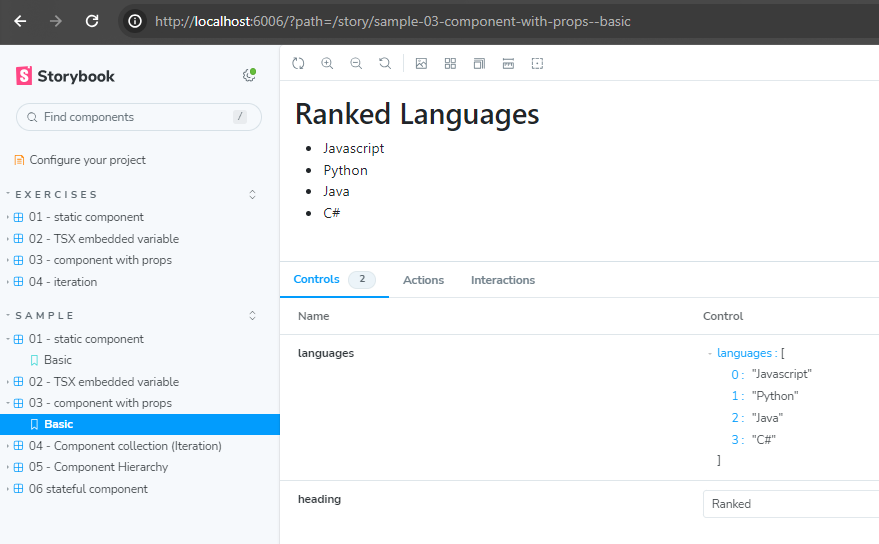
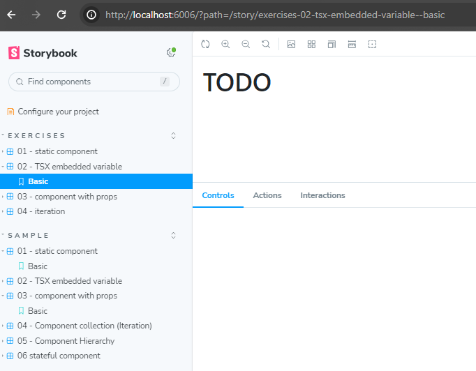

## Startup.

Download and unzip [this archive][code] and import it into VS Code. Open an integrated terminal in the editor and type:
~~~
$ npm install
~~~
[This installs the JS modules needed (e.g. React and its dependencies) in a local folder called `node_modules`.]

This lab contains the following top-level folder structure:
~~~
     basicReactLab
       |
       |---.storybook
       |---components
       |     |
       |     |---exercises
       |     |---samples
       |
       |---node_modules
       |---stories
       |---types
       |     |
       |     |---samples
       package.json
~~~
Your primary focus will be on the two sub-folders of `components`. The `components/samples` folder contains the sample components discussed in the lectures. The `components/exercises` folder has skeleton implementations of the components you will develop during this lab. In the terminal, type:
~~~
$ npm run storybook
~~~
This command is shorthand for:
>$ npx storybook dev -p 6006

The command runs the binary executable `./node_modules/.bin/start-storybook`. This executable transpiles all ts and tsx code, starts the storybook web server on port 6006, opens a web browser tab and navigates to http://localhost:6006 :

 

### The sample components.

Each file in the `components/samples` folder contains a component implementation. The file names are prefixed with a sequence number (01_, 02_ etc.) to help relate them to the text names appearing in the Storybook UI's side panel. For example, the component definition in `components/samples/03_props.tsx` is associated with  'Samples -> 03 - component with props' in the Storybook UI

 

It is conventional for a component file name to match the component name it exports. This practice is not applied here only for convenience.

The Storybook server provides live reloading or hot module replacement (HMR) - no need to refresh the browser after a code changes manually. For example, in the browser, click the `01 - static component` sample. Open the file `components/samples/01_staticComponent.tsx` and change the list of languages to the following:
~~~
<ul>
<li>Erlang</li>
<li>Clojure</li>
</ul>  
~~~
Save the change and return to the browser - the changed module is replaced in the browser automatically,

### The exercises components.

Click on any of the exercise components in the Storybook UI side panel - they are incomplete.

 

[code]: ./archives/archive-2.zip
[storybook]: ./img/storybook.png
[numbers]: ./img/numbers.png
[exercises]: ./img/exercises.png

