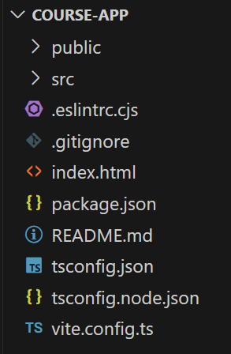
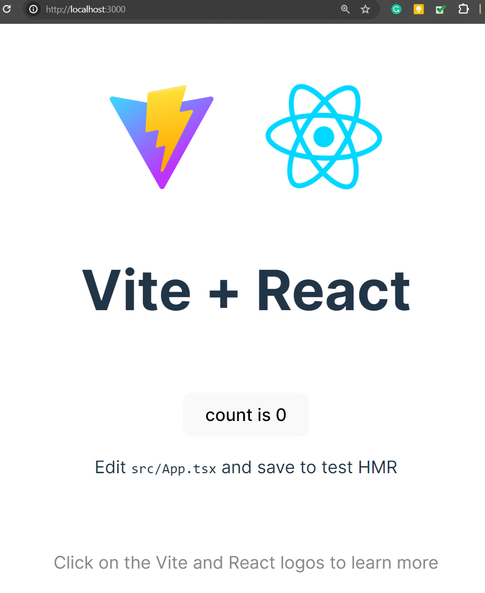

## Startup.

We will use the 'course modules' context again in this lab for convenience. 

Create a new empty folder (away from `basicReactLab`). Open an ordinary operating system terminal/shell window, go to the new folder and type the commands:
~~~
$  npm create vite@latest
~~~
Vite asks a series of questions about the app you want to create. Use the screenshot below to guide you through the answers.

Vite will **scaffold** a React project located in a new folder called `course-app` with content similar to that illustrated below:

Files with the `.tsx` extension are React component files. 

Drag-n-drop the `course-app` folder into VS Code. Open an integrated terminal and install the dependencies:
~~~
$ npm install
~~~

The default app is runnable from the outset. Before proving this, we will change the configuration so that the development server uses port 3000. Replace the content of `vite.config.ts` with the following:

~~~tsx
import { defineConfig } from 'vite'
import react from '@vitejs/plugin-react'

// https://vitejs.dev/config/
export default defineConfig({
  plugins: [react()],
  server: {
    port: 3000
  }
})
~~~
Type the following command in the integrated terminal:
~~~
$ npm run dev
~~~
This command performs the following task sequence:

- All the third-party modules are merged into one unit or bundle.
- The TSX files are transpiled into plain JS.
- The development server is started and listens on port 3000.

Open a new tab in the browser and navigate to http://localhost:3000/. The server responds with index.html, the individual compiled source code modules and the bundle containing the third-party modules.

Stop the development server and create a local Git repository:
~~~
$ git init
$ git add -A
% git commit -m "Initial structure."
~~~

-----------------------------

We will mould this skeleton app into our simple custom app. The desired user interface we want to achieve is similar to the following (Substitute the course name and module names accordingly):

![][obj]

The app's component hierarchy design will be as follows:
~~~
       App (default)
        |
        |
        V
      Programme
        |
        |  
        V
      Module
~~~
The App component renders a child called Course. Course renders many instances of a Module component. 

[vitestart]: ./img/vitestart.png
[scaffold]: ./img/scaffold.png
[obj]: ./img/obj.png
[default]: ./img/default.png
