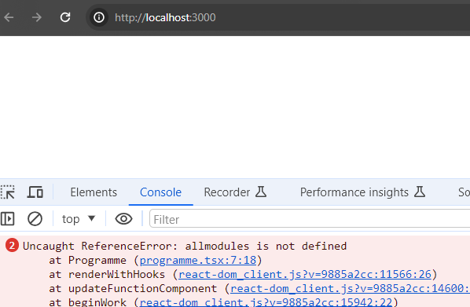

## Hot Module Replacement (HMR).

When a source code file/module is edited, Vite re-transpiles it and sends it down to the browser to replace the old version, i.e. Hot module replacement. HMR allows the developer to see the effect of the change immediately. As a simple example, in `src/App.tsx`, replace the line:
~~~tsx
  const name = "MSc Enterprise Software Systems";
~~~
with:
~~~tsx
  const name = "HDip in Computing";
~~~
Save the change and switch to the browser to see the changed UI.

The instant feedback of HMR also aids debugging. In `components/programme.tsx` change the line:
~~~tsx
  const list = modules.map((module, index) => (

~~~
with:
~~~tsx
  const list = allmodules.map((module, index) => (
~~~
The replaced module in the browser causes an error, which we discover immediately:

Undo the change to fix the error.

[error]: ./img/error.png
[error2]: ./img/error2.png
