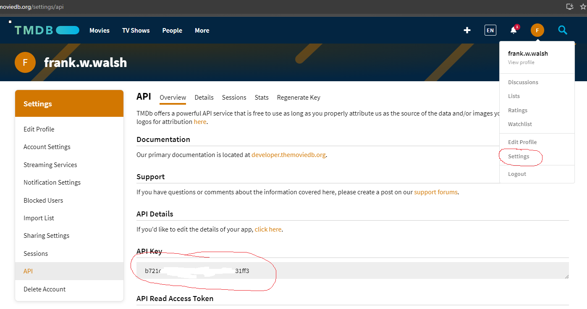

## Start-up.

Download [this archive][start], unzip it and import it into VS Code. Open an integrate terminal and run:

```
$ npm install
```

The archive contained a skeleton Vite project for a React app. The `src` folder has been divided into several subfolders to reflect the different code elements of a React app based on best practices.

Our Movies Fan app will communicate with The TMDB API (Note: We will use version 3 of the API). An API Key authenticates all requests to the API. Please follow these steps to acquire a personal key for development:

- Signup for an account [here][signup].
- Log in to your account. To get a key, follow this sequence:

>>Settings > API > Create > Click on Request an API > Click "Developer" > Fill in form details (use localhost:3000 for the URL and an arbitrary description)



In VS Code, in the project base folder, create a new file called `.env` with the following content:

```
VITE_TMDB_KEY=.... your API key value ...
```

Later we will use this environment variable in HTTP calls to the API.

It is imperative to keep your API key private. For example, never include it in a project pushed up to GitHub. Notice, in `.gitignore`, it is listed in `.env` to safeguard against this.

---

## GitHub repository.
Create a repo in your GitHub account called 'labMoviesApp' and add it as a remote repo for the movies app project on your local computer. Type the following commands in the VS Code integrated terminal:
~~~
git init
git add --all
git commit -m "initial commit"
git branch -M main
git remote add origin https://github.com/..your username.../labMoviesApp.git
git push -u origin main
~~~

Now, log in to [Moodle][moodle] and navigate to the Assessment section of this module. Click the 'Submit Lab Repo' link and upload a simple text file (reactLab.txt) that contains the URL of the GitHub repository you created. **Note that labs are part of the module's assessment. Please follow the commit instructions at the end of each step .**

## The Development process.

_Thinking in React_ is a development process recommended by the React design team (discussed in the lectures). This lab is focused on the first step of this process, titled `Build a static version` of the app. In subsequent labs, we will add user interaction and routing.

---------------------------------------


[start]: ./archives/startercode-ts.zip
[signup]: https://www.themoviedb.org/account/signup
[tmdb]: https://developers.themoviedb.org/3/getting-started/introduction
[apikey]: ./img/apikey.png
[moodle]: https://moodle.wit.ie/course/view.php?id=185752&section=5
