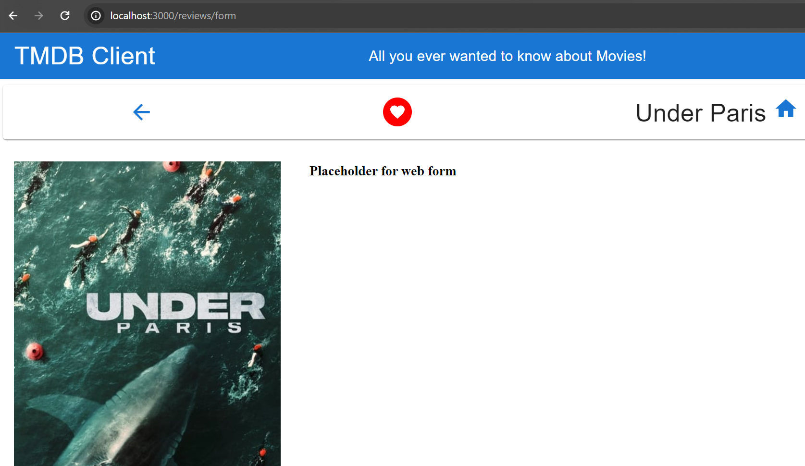

## Add a Movie Review.

On the favourite movies page, clicking a movie's RateReview icon should allows the user write a review. We will store reviews in the moviesContext as a temporary solution but in a production app, it would be sent to the API for storage in a database. 

In `components/cardIcons/writeReview.tsx`, replace the entire content with:
~~~tsx
import React from "react";
import RateReviewIcon from "@mui/icons-material/RateReview";
import {BaseMovieProps} from "../../types/interfaces"
import { Link } from "react-router-dom";

const WriteReviewIcon:React.FC<BaseMovieProps> = (movie) => {
  return (
    <Link
    to={'/reviews/form'}
    state={{
        movieId: movie.id,
      }}
  >
    <RateReviewIcon color="primary" fontSize="large" />
  </Link>
  );
};

export default  WriteReviewIcon;
~~~
The icon/Link routes the app to the URL '/reviews/form' and includes the movie's Id as additional data/state. Create the file `components/reviewForm/index.tsx`, and add the following temporary code:
~~~tsx
import React from "react";
import { BaseMovieProps } from "../../types/interfaces";

const ReviewForm: React.FC<BaseMovieProps> = (movie) => {
    return (
        <h3>Placeholder for web form</h3>
    );
};

export default ReviewForm;
~~~
Create the file `src/pages/addMovieReviewPage.tsx`, and add this code:
~~~tsx
import React from "react";
import PageTemplate from "../components/templateMoviePage";
import ReviewForm from "../components/reviewForm";
import { useLocation } from "react-router-dom";
import { useQuery } from "react-query";
import { getMovie } from "../api/tmdb-api";
import Spinner from "../components/spinner";
import { BaseMovieProps, MovieDetailsProps } from "../types/interfaces";

const WriteReviewPage: React.FC = () => {
    const location = useLocation()
    const { movieId } = location.state;
    const { data: movie, error, isLoading, isError } = useQuery<MovieDetailsProps, Error>(
        ["movie", movieId],
        () => getMovie(movieId)
    );

    if (isLoading) {
        return <Spinner />;
    }

    if (isError) {
        return <h1>{error.message}</h1>;
    }
    return (
        <>
            {movie ? (
                    <PageTemplate movie={movie}>
                        <ReviewForm {...movie} />
                    </PageTemplate>
            ) : (
                
Waiting for movie review details

            )}
        </>
    );
};

export default WriteReviewPage;
~~~
Update the routing configuration in `src/index.tsx`, as follows:

+ add an import at the top:
~~~js
import AddMovieReviewPage from './pages/addMovieReviewPage';
~~~

+ add a new route to the list:
~~~js
    <Routes>
        <Route path="/reviews/form" element={<AddMovieReviewPage/>} />
        . . . . other routes . . . . 
    </Routes>
~~~
In the browser, go to the favourite movies page and click the RateReview icon of a movie. It should display our new page:

### Web forms in React.

Web forms tend to have a standard feature set, e.g. field validation and error messages, submit action, reset fields, etc. We will use a 3rd party module to simplify implementing these requirements - the react-hook-form library ([read more][useform]). [See react-hook-form in `package.json`.] 

In ``/types/interfaces.ts``, add the following interface definition that describes the shape of a movie review:

~~~tsx
  export interface Review {
    author: string,
    content: string,
    agree: boolean,
    rating: number,
    movieId: number,
  }
~~~

In `components/reviewForm` make the following changes:
- Create the file `ratingCategories.ts`:
~~~ts
const ratings = [
  {
    value: 5,
    label: "Excellent",
  },
  {
    value: 4,
    label: "Good",
  },
  {
    value: 3,
    label: "Average",
  },
  {
    value: 2,
    label: "Poor",
  },
  {
    value: 0,
    label: "Terrible",
  },
];
  export default ratings
~~~
- Create the file `styles.ts`:
~~~js
const styles =  {
  root: {
    marginTop: 2,
    display: "flex",
    flexDirection: "column",
    alignItems: "left",
  },
  form: {
    width: "100%",
    "& > * ": {
      marginTop: 2,
    },
  },
  textField: {
    width: "40ch",
  },
  submit: {
    marginRight: 2,
  },
  snack: {
    width: "50%",
    "& > * ": {
      width: "100%",
    },
  },
};
export default styles
~~~
- Replace the content of `index.tsx` with the following:,
~~~js
import React, { useContext, useState, ChangeEvent } from "react";
import Button from "@mui/material/Button";
import TextField from "@mui/material/TextField";
import MenuItem from "@mui/material/MenuItem";
import Typography from "@mui/material/Typography";
import Box from "@mui/material/Box";
import { useForm, Controller, SubmitHandler } from "react-hook-form";
import { MoviesContext } from "../../contexts/moviesContext";
import { useNavigate } from "react-router-dom";
import styles from "./styles";
import ratings from "./ratingCategories";
import { BaseMovieProps, Review } from "../../types/interfaces";

const ReviewForm: React.FC<BaseMovieProps> = (movie) => {
    const defaultValues = {
        defaultValues: {
          author: "",
          review: "",
          agree: false,
          rating: 3,
          movieId: 0,
        }
      };
    
      const {
        control,
        formState: { errors },
        handleSubmit,
        reset,
      } = useForm<Review>(defaultValues);
    
      const navigate = useNavigate();
      const context = useContext(MoviesContext);
      const [rating, setRating] = useState(3);
    
    
      const handleRatingChange = (event: ChangeEvent<HTMLInputElement>) => {
        setRating(Number(event.target.value));
      };
    
      const onSubmit: SubmitHandler<Review> = (review) => {
        review.movieId = movie.id;
        review.rating = rating;
        console.log(review);
      };
    
      return (
        <Box component="div" sx={styles.root}>
          <Typography component="h2" variant="h3">
            Write a review
          </Typography>
          <form style={styles.form} onSubmit={handleSubmit(onSubmit)} noValidate>
            <Controller
              name="author"
              control={control}
              rules={{ required: "Name is required" }}
              defaultValue=""
              render={({ field: { onChange, value } }) => (
                <TextField
                  sx={{ width: "40ch" }}
                  variant="outlined"
                  margin="normal"
                  required
                  onChange={onChange}
                  value={value}
                  id="author"
                  label="Author's name"
                  autoFocus
                />
              )}
            />
            {errors.author && (
              <Typography variant="h6" component="p">
                {errors.author.message}
              </Typography>
            )}
            <Controller
              name="content"
              control={control}
              rules={{
                required: "Review cannot be empty.",
                minLength: { value: 10, message: "Review is too short" },
              }}
              defaultValue=""
              render={({ field: { onChange, value } }) => (
                <TextField
                  variant="outlined"
                  margin="normal"
                  required
                  fullWidth
                  value={value}
                  onChange={onChange}
                  label="Review text"
                  id="review"
                  multiline
                  minRows={10}
                />
              )}
            />
            {errors.content && (
              <Typography variant="h6" component="p">
                {errors.content.message}
              </Typography>
            )}
    
            <Controller
              control={control}
              name="rating"
              render={({ field }) => (
                <TextField
                  {...field}
                  id="select-rating"
                  select
                  variant="outlined"
                  label="Rating Select"
                  value={rating}
                  onChange={handleRatingChange}
                  helperText="Don't forget your rating"
                >
                  {ratings.map((option) => (
                    <MenuItem key={option.value} value={option.value}>
                      {option.label}
                    </MenuItem>
                  ))}
                </TextField>
              )}
            />
    
            <Box >
              <Button
                type="submit"
                variant="contained"
                color="primary"
                sx={styles.submit}
              >
                Submit
              </Button>
              <Button
                type="reset"
                variant="contained"
                color="secondary"
                sx={styles.submit}
                onClick={() => {
                  reset({
                    author: "",
                    content: "",
                  });
                }}
              >
                Reset
              </Button>
            </Box>
          </form>
        </Box>
      );
    };
    

export default ReviewForm;
~~~

The useForm hook in the above code is the cornerstone. The properties of the object it returns connect the hook's form processing logic to our web form. The properties include:

+ handleSubmit - a function to connect our custom form submit event handler to react-hook-form.
+ reset - a function to reset the form fields.
+ errors - an object populated with field validation error messages computed from the validation rules declared in the Controller components.
+ control - a function for controlling a field on the web fork.

The react-hook-form library also provides the Controller component for managing a form field. It declares the field's validation criteria (rules), name, and how it should render (render). For example, the code for the review content field is as follows:
~~~js
<Controller
    name="content"
    control={control}
    rules={{
        required: "Review cannot be empty.",
        minLength: { value: 10, message: "Review is too short" },
    }}
    defaultValue=""
    render={({ field: { onChange, value } }) => (
        <TextField
            variant="outlined"
            margin="normal"
            required
            fullWidth
            value={value}
            onChange={onChange}
            label="Review text"
            id="review"
            multiline
            minRows={10}
        />
    )}
/>
~~~
The render prop above is an example of the Render prop pattern. The callback assigned to it is invoked by the Controller, passing it the current value of the field and a default onChange event handler. The validation rules object above uses prescribed keys (e.g. required, minlength, min, max). The hook enforces these rules, and it records any violations in an errors object, which we use to control the display of error messages, for example:
~~~js
        {errors.review && (
          <Typography variant="h6" component="p">
            {errors.review.message}
          </Typography>
        )}
~~~
The error messages appear under the offending field, as shown below:

![][errorform]

### Storing the reviews.
As an interim solution, we will store reviews in the MoviesContext.

In `contexts/moviesContext.tsx`, make the changes shown below:
~~~tsx
import React, { useState, useCallback } from "react";
import { BaseMovieProps, Review } from "../types/interfaces";

interface MovieContextInterface {
    favourites: number[];
    addToFavourites: ((movie: BaseMovieProps) => void);
    removeFromFavourites: ((movie: BaseMovieProps) => void);
    addReview: ((movie: BaseMovieProps, review: Review) => void);  // NEW
}
const initialContextState: MovieContextInterface = {
    favourites: [],
    addToFavourites: () => {},
    removeFromFavourites: () => {},
    addReview: (movie, review) => { movie.id, review},  // NEW
};
..... other code as before .....

const MoviesContextProvider: React.FC<React.PropsWithChildren> = ({ children }) => {
    const [myReviews, setMyReviews] = useState<Review[]>( [] )  // NEW

  ..... other code as before  .....

    const addReview = (movie:BaseMovieProps, review: Review) => {   // NEW
        setMyReviews( {...myReviews, [movie.id]: review } )
      };

 return (
        <MoviesContext.Provider
            value={{
                favourites,
                addToFavourites,
                removeFromFavourites,
                addReview,    // NEW
            }}
        >
            {children}
        </MoviesContext.Provider>
    );

export default MoviesContextProvider;
~~~
In `components/reviewForm/index.tsx`, update the onSubmit function:
~~~js
     const onSubmit: SubmitHandler<Review> = (review) => {
        review.movieId = movie.id;
        review.rating = rating;
        context.addReview(movie, review);
        
      };
    
~~~
In the browser, try adding a review for a favourite movie. 

It works, but a better user experience would be to acknowledge the review submission. We will use the Material Snackbar component to serve this purpose.

![][snackbar]

In `components/reviewForm/index.tsx`:
- Add two new imports:
~~~js
import Snackbar from "@mui/material/Snackbar";
import Alert from "@mui/material/Alert";
~~~
- Add another state variable declaration (after rating):
~~~js
  const [open, setOpen] = useState(false);  //NEW
~~~
- Add an event handler (before onSubmit):
~~~js
  const handleSnackClose = () => {
    setOpen(false);
    navigate("/movies/favourites");
  };

~~~
- change the onSubmit event handler:
~~~js
     const onSubmit: SubmitHandler<Review> = (review) => {
        review.movieId = movie.id;
        review.rating = rating;
        context.addReview(movie, review);
        setOpen(true); // NEW
        // console.log(review);
      };

~~~
- Add the `Snackbar` component, just before the `form` component:
~~~tsx
      <Snackbar
        sx={styles.snack}
        anchorOrigin={{ vertical: "top", horizontal: "right" }}
        open={open}
         onClose={handleSnackClose}
      >
        <Alert
          severity="success"
          variant="filled"
          onClose={handleSnackClose}
        >
          <Typography variant="h4">
            Thank you for submitting a review
          </Typography>
        </Alert>
      </Snackbar>
~~~
Now when the user clicks the submit button, the snackbar acknowledgement displays. Clicking its close icon will redirect the browser back to the favourites page. 

Update the git repository as follows:
~~~
$ git add -A
$ git commit -m "Add new review support."
$ git push origin main
~~~

[reviewform]: ./img/reviewForm.png
[useform]: https://react-hook-form.com/
[errorform]: ./img/errorform.png
[snackbar]: ./img/snackbar.png
